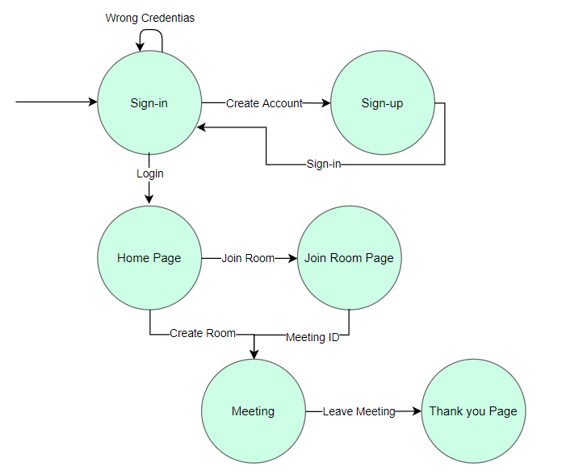

# Pikachu_meet
Pikachu meet is a video conferencing application using HTML, CSS, JavaScript, Node.js, Express.js, Peerjs, Socket.io, ejs, uuid, mysql, npm and nodemon. It is a Social Networking digital communication web application that provides video chat between computers, tablets and mobile devices through a web browser.
## Installation of libraries
### Initialize npm (node package manager)
> npm init -y
---
### Install expressJs, ejs, socket.io, uuid, nodemon and mysql library
> npm i express ejs socket.io uuid nodemon mysql
---
Install peerJS library
> npm i -g peer
---
_Open the terminal_
---
**Start the nodejs server**
---
> npm run devStart
---
_Open another bash terminal to start Peer server_
---
**Start the peerjs server in port 3001**
---
> peerjs --port 3001
---
***Design***
---
